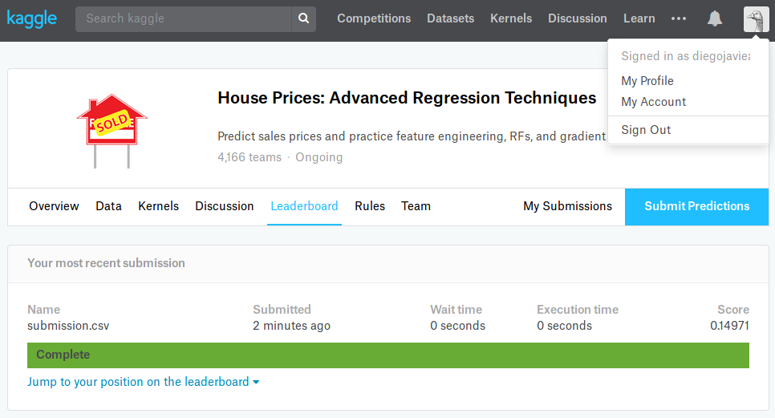

# Sistemas Inteligentes

Las soluciones desarrolladas son para el problema del siguiente enlace https://www.kaggle.com/c/house-prices-advanced-regression-techniques.

## Algoritmos usados

Se aplicaron tres algoritmos al problema indicado.

### Regresión Lineal Simple

Se uso la librería proporcionada por sklearn.

### Random Forest

Se uso la librería proporcionada por sklearn.

### Regresión Lineal Múltiple

Implementación propia

### Imagen del Score de Kaggle

